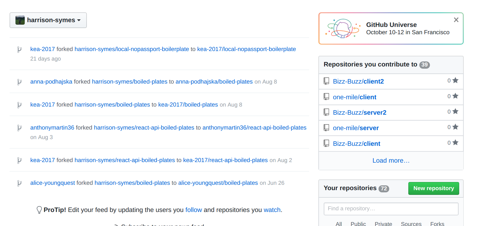
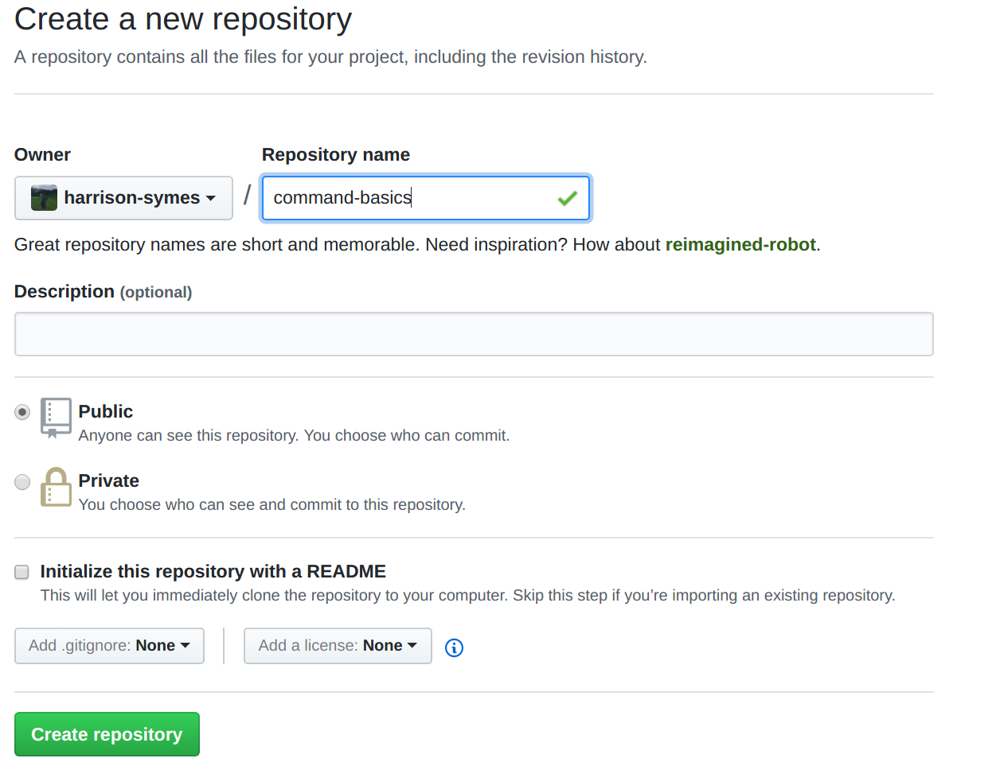
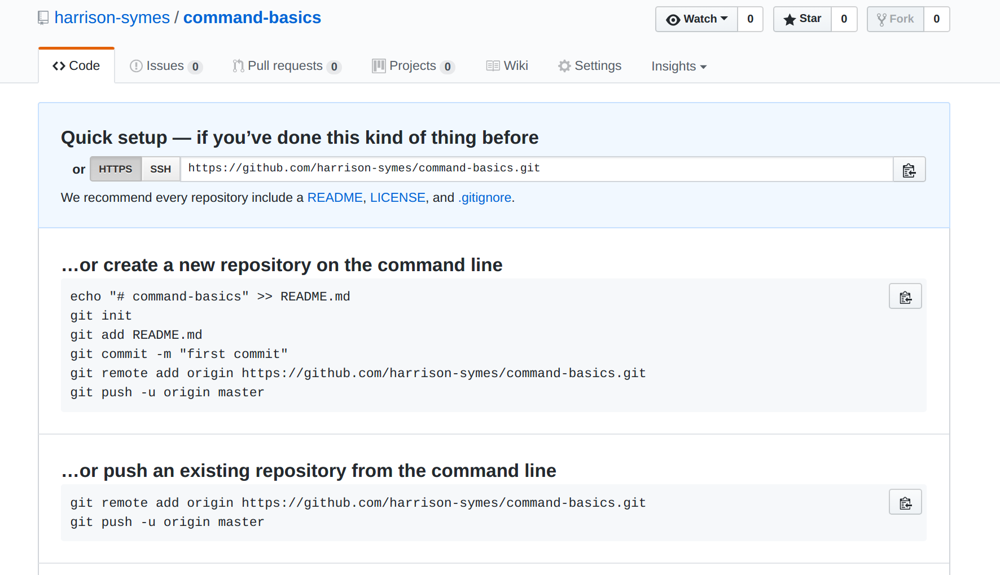
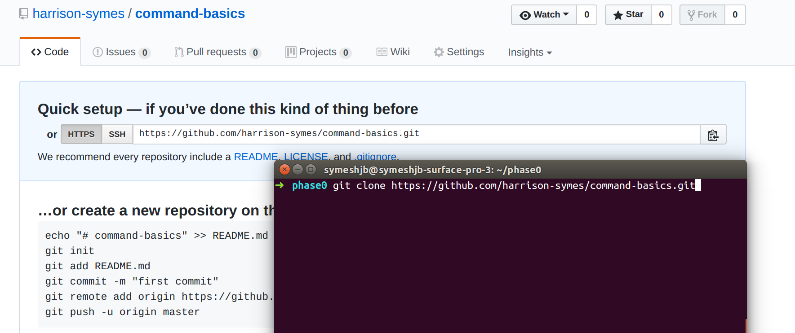
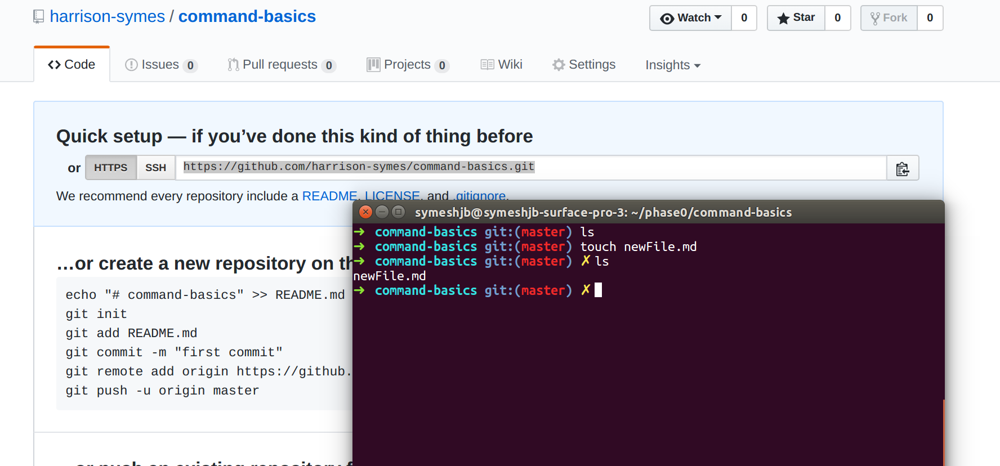
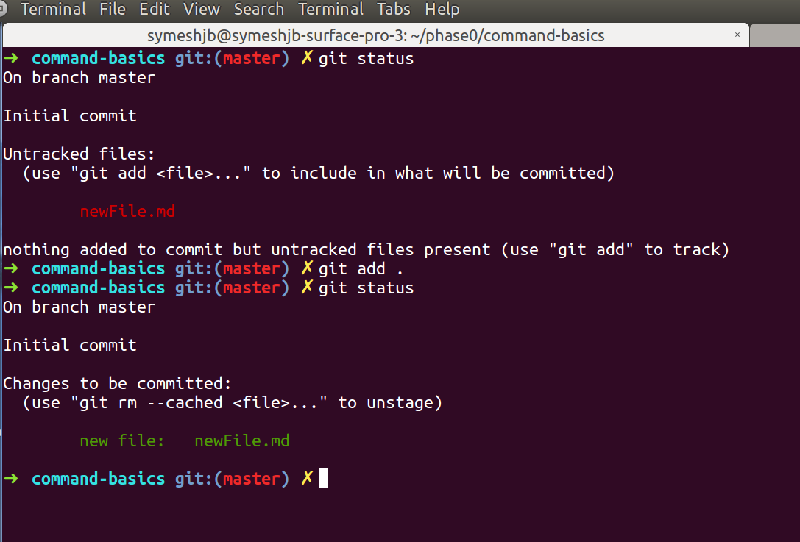
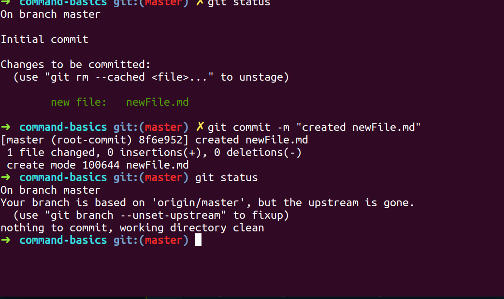
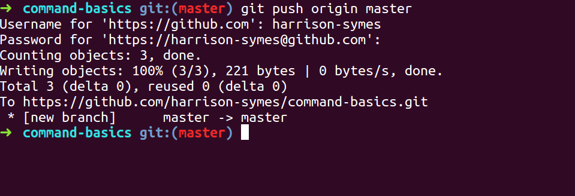
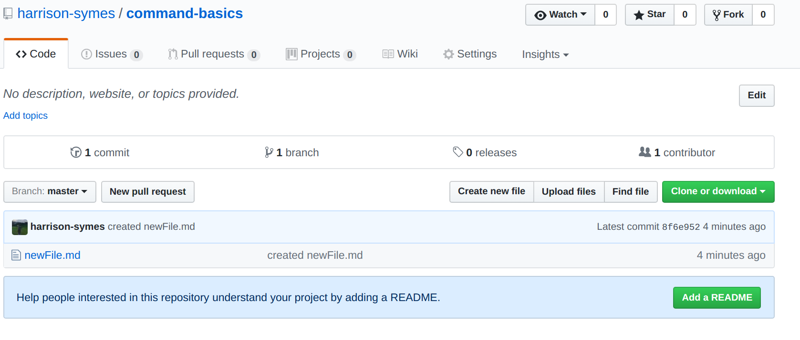

# Git / Command Line Basics

## Links
 - [Making a Repo](#make-a-new-repository)
 - [Cloning](#cloning-a-repository)
 - [Making a File](#making-a-file)
 - [Pushing to github](#pushing-to-github)
    - [Add](#add)
    - [Commit](#commit)
    - [Push](#push)

## Make a new repository

  * On github, navigate to your main page
  * Make sure you see your username/image on the top left dropdown (refer to image)
  * Click the green button on the bottom right (refer to image) to create a new Repository

  * Type the name of your new repo in the text input (sprint-1, for example)
  * Don't worry about the other options for now, hit that green button at the bottom to create your repo

  * You should see something like the image above
  * This means your repo has been created, but it has nothing inside it. It still exists though! Copy that url in the 'quick setup' section, and now we are gonna clone your empty repo dropdown

## Cloning a Repository

  * Navigate to your workspace folder in your terminal by running `cd ~/workspace`
  * Then run the command `git clone GIT_URL_HERE` to clone down your repo.
  * If you run the `ls` command you should see an empty folder with the same name as the repository that you just created (like 'sprint-1')

## Making a file

  * navigate to your new directory with `cd REPO_NAME_HERE`
  * run the command `touch NEW_FILE_NAME` to create a new file within your current working directory
  * Create a file with the `.md` extension to make a snazzy readme file (similar to this one you are reading)

  * The file is empty, but it does exists, so let's push it up to github, as our github repo is still empty, `IT DOES NOT KNOW ABOUT OUR NEW FILE YET!`

## Pushing to github

  **Add**:
  * To push this new file up to github, we first need to `stage` our changes. We do this by running `git add FILE_NAME_HERE`, or alternatively, `git add .` will stage all of our new files / file changes
  * You can view the files that havent / have been staged by running `git status`, where the red file names are files that are changed but havent been stages, and green are changes that HAVE be staged

  **Commit:**
  * Next we need to `commit` our staged changes. This is like settiing our added changes to our git, and giving a message to describe our changes
  * You can make a commit by running the command `git commit -m "COMMIT_MESSAGE_HERE"`
    * `-m` means "I want to give a message with my commit"
    * The message should be something concise that describes your changes, such as "created command-line.md"
  * Once you have commited, running `git status` again should show that there are no changes to be commited anymore

  **Push:**
  * Now that are changes are added and commited, we can `push` them up to github. Remember: our changes are still not up on github!
  * Whenever you push to github, you are simply adding the changes that you have commited, pushing without adding and commiting will not apply your local changes to github.
  * To push, simply run `git push origin master`
  * You may be prompted to enter a username and a password, these are just the credentials for your `github` account. The password will not be displayed on the terminal

  * After doing this, your repo on github should now have your new file(s) in it!

  * We can see our commit message is displayed on the line where our new file exists, between the file name and the 'last commit time'
