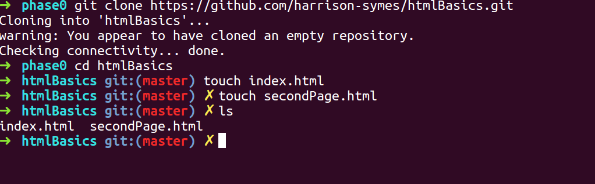
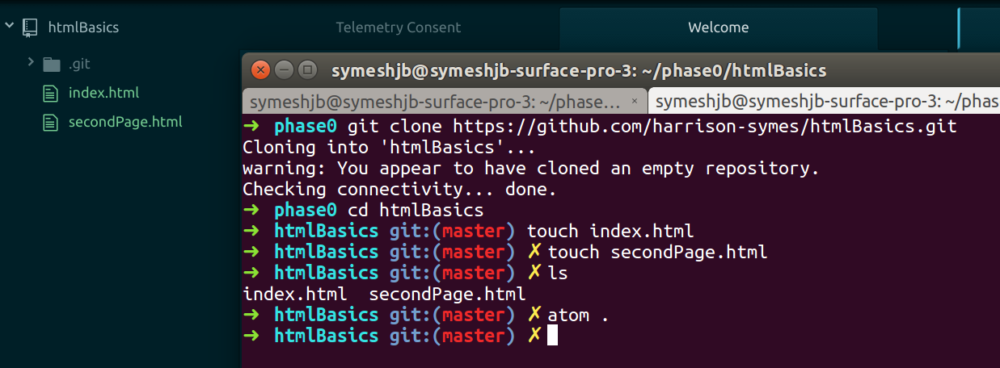
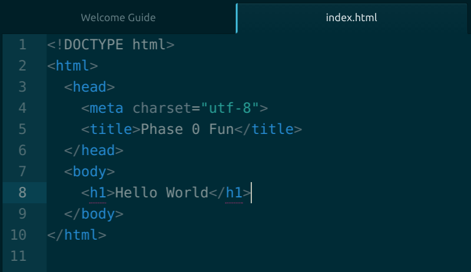
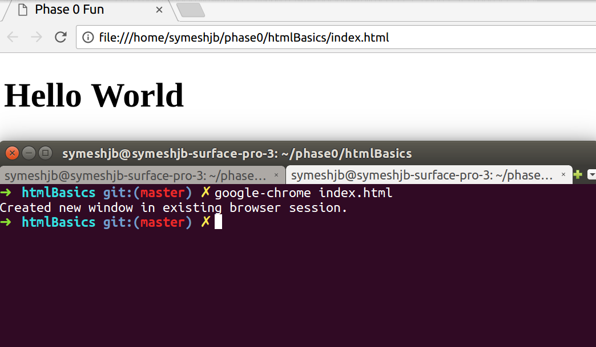
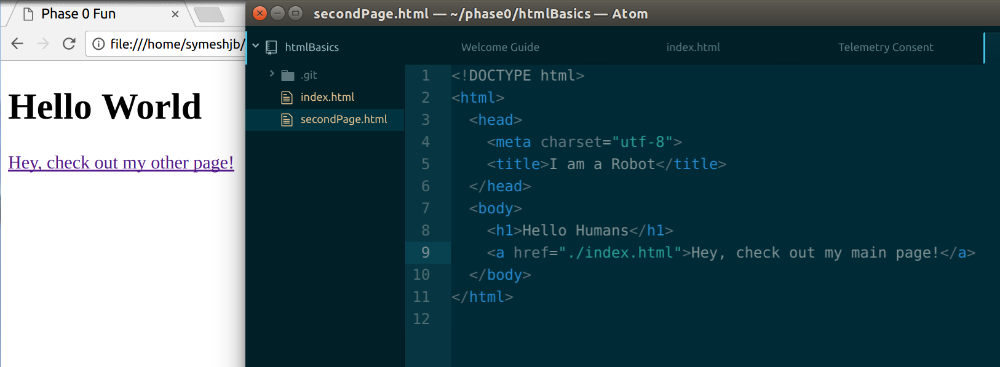
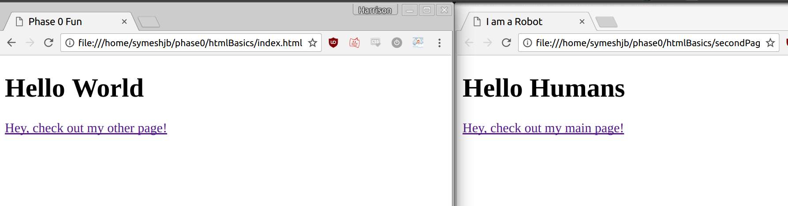
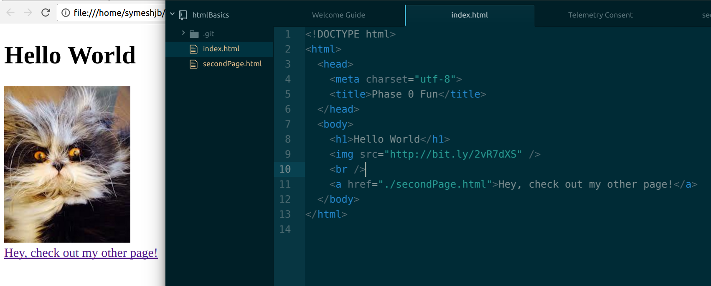

# Creating and Viewing a basic HTML page

## Links
  - [Setting up your files](#setup)
  - [Html Template](#html-template)
  - [View Your Page](#view-your-page)
  - [Link Between Pages](#linking-between-pages)
  - [Adding an Image](#add-an-image)

---

### Setup
* To get started, create and clone down a new repository where you will be creating your pages
* Navigate to your repo in your terminal, and run the command `touch index.html` to page a file for your main page
  * It is convention to name your home page **index.html**
  * The `.html` extension is important for the file to be recognised as an HTML file
* Let's also make a second page for later on. Call it whatever you want, for this example, I will call it **secondPage.html**, so I'll run `touch secondPage.html` to create it



* Finally, open up your files in atom by running `atom .` This will open your whole directory in atom, so you can view and edit your two files



### Html Template

```HTML
<!DOCTYPE html>
<html>
  <head>
    <meta charset="utf-8">
    <title></title>
  </head>
  <body>

  </body>
</html>
```

* Copy the HTML template from above and paste it into both your **index.html** and whatever you called your other **.html** file
* Give your page a **title** by inserting some text in between the opening `<title>` and closing `</title>` tags. This title is what will display on the browser tab when a user has your page open
  * For example, I am going to call my page `Phase 0 Fun`, so I have the line `<title>Phase 0 Fun</title>` in the head of my html
* The best way to check that anything in code works, is to start with a **Hello World**, so in between the opening and closing `<body>` tags, insert the line `<h1>Hello World</h1>`



* Give your second page a title as well, and maybe a hello world with different text

### View your page

* On your terminal / command-line, navigate to your repo's directory
* From your repo, run the command `google-chrome index.html`
  * If you don't have google-chrome, or your terminal does not recognise the command, you can always use your regular file browser (GUI), right click the index.html file, and choose `open with` and your browser of choice



* Hopefully you will see your title in the tab and your **Hello World** displayed in your browser
* Now in the same way, open your second `.html` file in your browser, checking that the title and the **Hello World** text are visible

### Linking between pages

* In your **index.html** file on atom, we want to create a link that redirects to your second web page
* Html links are done using `<a>` tags. These are how hyperlinks, which you have seen on every website ever, are made.
  * The text between the `<a>` tags is what will be displayed to click on as the link, so pick something that makes sense, like `Hey, check out my other page!`
* You need to give an attritube to the opening `<a>` tag that tells the link where it will link to. The attribute name is `href`, and it should be equal to the file path of your second page.
  * This may be a bit confusing, but if you followed these steps, the relative path to your second page should be `./SECOND_FILE_NAME.html`
* Bringing all of this together, your overall link should be something like this: `<a href="./secondPage.html">Hey, check out my other page!</a>`



* Reopening/Reloading your page, your link should be visibile and your code should look something like this, and clicking on the link should take you to your other page
* Now try adding a link from your second page back to your main page. The relative path for your link will need to be `./index.html` now, and some different text will help clarify where the link will take you



### Add an Image

* Find an image on the internet that you want to put on your main page, or use this one here `http://bit.ly/2vR7dXS`
* An image is defined by a **self closing** `` tag, which means that the tag opens and closes in one tag, rather than two.
* Tell your `` tag to draw an image from by giving it a `src` attribute that refers to your image.  
* For web images it is as simple as writing ``
* To use an image file from your repo, just replace the IMAGE_URL with the relative file path for your image, such as `./images/funnyCat.png`



---
